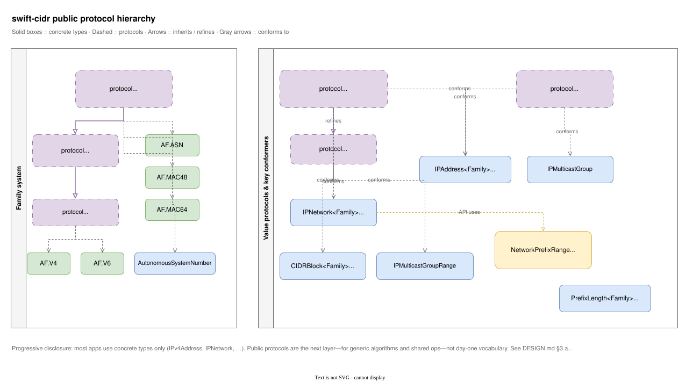

# Design: Why each type exists

This document explains the **architecture** of `swift-cidr`: why public types exist, how they map to Internet standards, and how the package separates **classless address-space math** from **host and context-of-use** composition.

It is written for adopters, contributors, and the [Swift Networking Workgroup](https://www.swift.org/networking-workgroup/) when exploring prior art. It is **not** a proposal that every type must appear in a future standard library surface.

For hands-on guides, see [Learning](Learning/README.md). For real consumers of this package, see [Examples](Examples.md). For non-public helpers, see [INTERNALS](INTERNALS.md).

---

## 1. Purpose and non-goals

### Purpose

Provide **value-semantic currency types** for classless IP addressing, exact address coverage, and closely related routing identifiers so network-infrastructure software (routing, policy, IPAM, RPKI, IRR tooling, configuration, telemetry) can share one precise foundation instead of ad hoc strings and host-only models.

### Non-goals

- Socket I/O, URLSession, or a full networking stack
- Operational state (RIB/FIB, BGP path attributes, live sockets)
- Service-name registries, transport protocol selection (TCP vs UDP)
- Cryptographic RPKI validation (consumers use prefixes + lengths + ASNs produced here)
- Host-local interface tables as part of core math (scoped addresses belong in a host/context layer)

---

## 2. Narrative: RFC 4632 and expanded prefix usage

### Core plan (RFC 4632)

This is where the full meaning of CIDR matters.

[RFC 4632](https://datatracker.ietf.org/doc/html/rfc4632) is not merely a specification for parsing text containing a slash. Its title is *Classless Inter-domain Routing: The Internet Address Assignment and Aggregation Plan*:

- **Classless** means that a network boundary is represented by an explicit prefix length rather than inferred from the former IPv4 Class A/B/C divisions. For IPv4, this is the variable-length prefix model associated with VLSM. IPv6 was designed around prefixes from the outset: its routing architecture supports prefix lengths from `/0` through `/128`, although `/64` is conventional for subnets using SLAAC. In both families, prefixes provide boundaries for routing and aggregation.
- **Inter-domain** places these values in the context of independently administered networks, commonly Autonomous Systems, with different operational and policy boundaries.
- **Routing** makes prefixes and their aggregation Layer 3 control-plane concepts, not merely presentation formats for host addresses.

This wording is the package’s **canonical abbreviated definition of CIDR** (aligned with the same framing on the Swift Forums). Prefer it over shorter “slash notation” glosses when explaining what CIDR means here.

The **native unit of that plan** is **prefix-shaped address space**: what this package calls a canonical **network** (`IPNetwork` / `IPPrefix`).

### Expanded usage

The same classless math is reused far beyond a single routing table entry:

| Context | Package modeling |
|---------|------------------|
| Route / filter / many policy keys | `IPNetwork` |
| RIR / allocation-shaped blocks | `CIDRBlock` ([RFC 7020](https://datatracker.ietf.org/doc/html/rfc7020)) |
| RPSL more-specific / length-range selection | `NetworkPrefixRange` ([RFC 2622](https://datatracker.ietf.org/doc/html/rfc2622)) |
| Host or interface-style `addr/len` | `IPAddress` + `PrefixLength` (address with prefix **context**) |
| Inclusive address interval / normalized exact union | `IPAddressRange` / `IPAddressCoverage` (coverage, not prefix identity) |
| RPKI ROA base prefix + optional `maxLength` | `IPNetwork` + `PrefixLength` as **consumers** of length currency ([RFC 9582](https://datatracker.ietf.org/doc/html/rfc9582)) |
| Multicast destinations | `IPMulticastGroup` / `IPMulticastGroupRange` (not unicast subnet ceremony) |
| Inter-domain origin / peer identity | `AutonomousSystemNumber` (with routes, ROAs, IRR—not BGP-only) |

**Composable types** exist so those roles do not collapse into one hybrid “CIDR wrapper” around a host address.

---

## 3. Progressive disclosure

You do not need the full surface for every app.

| Path | Start here | Add when needed |
|------|------------|-----------------|
| **Common / end-host** | `IPv4Address`, `IPv6Address` | Later: host/context layer for `Port`, endpoint, scoped IPv6 |
| **Infrastructure** | + `PrefixLength`, `IPNetwork` | `IPAddressRange`, `IPAddressCoverage`, `CIDRBlock`, `NetworkPrefixRange`, ASN, multicast, `AnyIP*` |
| **Protocols** (generic / library code) | still concrete types first | `CIDR`, `IPPrefix`, `Addressable`, `AddressFamily` / `IPAddressFamily` when writing shared algorithms or new conformers |

**Public protocols are part of progressive disclosure**, not day-one vocabulary. Most programs only touch **concrete currency types** (and aliases such as `IPv4Address`). You reach for protocols when:

- you write **generic** helpers (`func summarize<P: IPPrefix>(…)`, `where Family: IPAddressFamily`);
- you need the **shared storage + length** surface without choosing one form (`CIDR`);
- you implement or document a **new form** that should share math with existing types.

They are **not** a second parallel product surface you must learn before parsing `"192.0.2.1/24"`. Meaning still lives in the concrete type (§5–§6); protocols factor structure and operations.

### Protocol hierarchy

Editable source: [protocol-hierarchy.drawio](Architecture/protocol-hierarchy.drawio).

Two related trees:

1. **Family system** — `AddressFamily` → `IPAddressFamily` → `MulticastAddressSpace`, with marker types (`AF.V4` / `AF.V6` / `AF.ASN` / MAC families). IP CIDR value types require `IPAddressFamily`; non-IP families stay out of prefix math.
2. **Value protocols** — `CIDR` (storage + prefix length) refined by `IPPrefix` (aligned prefix ops); `Addressable` for singular address identity. Key conformers: `IPNetwork` (`IPPrefix`), `IPAddress` (`CIDR` + `Addressable`), `CIDRBlock` / `IPMulticastGroupRange` (`CIDR`), `IPMulticastGroup` (`Addressable`). `NetworkPrefixRange` is a **selector** (not `CIDR`); it *uses* `IPPrefix` in APIs. `PrefixLength` is length currency, not a CIDR form.

The breadth of types **and** protocols is **depth for control-plane, policy, and library work**, not a claim that every program must import every symbol on day one.

---

## 4. Type map (public currency)

Primary cite = strongest definition of the concept. Secondary = important consumers or related rules.

| Type / protocol | Why it exists | Why not a neighbor | Primary standard(s) | Also / consumers |
|-----------------|---------------|--------------------|---------------------|------------------|
| `AddressFamily` | Compile-time IANA family + width, parse/format hooks | Not a runtime-only tag when generic algorithms need width | [IANA Address Family Numbers](https://www.iana.org/assignments/address-family-numbers/) | — |
| `IPAddressFamily` | IP-only refinement so MAC/ASN do not enter IP CIDR ops | Not every `AddressFamily` is an IP space | RFC 791, RFC 4291 | — |
| `AF.V4` / `AF.V6` | Concrete IP family markers | — | RFC 791, RFC 4291 | RFC 7608 (any length 0…128 in forwarding) |
| `AF.MAC48` / `AF.MAC64` | L2 currency in the same family *pattern* | Not IP networks or prefixes | IANA AF numbers | IEEE 802 as needed |
| `AF.ASN` | Family marker for AS number storage | Not an IP | RFC 1930 | — |
| `PrefixLength<Family>` | Family-valid slash count; shared currency | Not raw `Int` (wrong width / silent bugs) | RFC 4632; RFC 4291 | ROA `maxLength` etc. (RFC 9582 consumer) |
| `IPAddress<Family>` | Address + prefix **context** (`192.0.2.77/24`) | Not a canonical network; host bits matter for identity | RFC 4632; RFC 4291 | Interface/config practice |
| `IPNetwork<Family>` | **Canonical** network / prefix (4632 unit) | Not address-with-context; host bits cleared | **RFC 4632** | BGP/IRR/RPKI *consumers* of prefixes |
| `IPAddressRange<Family>` | Exact inclusive interval of address bits | Not a CIDR prefix; endpoint prefix context is intentionally erased | Address-space math; package-defined text form | Can summarize exactly to `IPNetwork` values |
| `IPAddressCoverage<Family>` | Normalized exact union of disjoint address ranges | Not source-prefix identity or policy metadata | Address-space set math | Binary-search containment over normalized ranges |
| `IPPrefix` | Protocol for aligned-prefix ops (containment, subnets, summarize) | Not a stored value by itself | RFC 4632 | Implemented by `IPNetwork` |
| `CIDR` (protocol) | Shared “storage + prefix length” across forms | **Not** a single hybrid value type | RFC 4632 | See §6 |
| `CIDRBlock<Family>` | Neutral address-space block (allocation-shaped set math) | Not subnet/broadcast/gateway ceremony | RFC 4632; **RFC 7020** | RFC 6890 consumers |
| `NetworkPrefixRange<Family>` | Prefix **selector** (more-specific / length range) | Not one network; not an address | **RFC 2622** §2; RFC 4012 | Related idea: ROA maxLength (9582) |
| `IPMulticastGroup` / `Range` | Multicast destination identity / ranges | Not unicast subnet semantics | RFC 4291; RFC 4607; RFC 6308 | RFC 5771 where useful |
| `AnyIPAddress` / `AnyIPNetwork` / `AnyIPAddressRange` / `AnyPrefixLength` | Mixed-family API boundaries | Not a substitute for family-bound math | API need | Multi-family datasets and ROA sets (RFC 9582) |
| `AutonomousSystemNumber` | Numeric AS currency | Not RPSL `AS` text; not allocation registry | RFC 1930; **RFC 5396**; **RFC 6793** | **BGP, RPKI ROA origin, IRR, RPSL/policy** |
| `Port` | 16-bit transport port number only | Not service names or “Ethernet port” | Transport / [IANA ports](https://www.iana.org/assignments/service-names-port-numbers/) as reference | Host/context layer long-term |
| `IPEndpoint` | Address + port composition | Not TCP/UDP choice; not pure prefix math | Composition | **Host/context layer** (see §7, issue #10) |
| Text style enums | Presentation choices | Not network identity | RFC 5952 (v6); RFC 4291 | — |

Aliases such as `IPv4Network`, `ASN`, `IPv6PrefixLength` are conveniences over the generic types above.

---

## 5. Form comparison

| | `IPAddress` | `IPNetwork` | `CIDRBlock` | `NetworkPrefixRange` |
|--|-------------|-------------|-------------|----------------------|
| **Shape** | Address + prefix context | Canonical prefix | Neutral block | Selector over prefixes |
| **Host bits** | Preserved (identity) | Cleared | Cleared | N/A (base is a network) |
| **Typical use** | Host/interface-style values | Route/filter-shaped keys | Allocation / set math | RPSL-style more-specifics |
| **Projection** | `.network` → `IPNetwork` (lossy) | — | Related math, different role | Built from a base `IPNetwork` |

### Exact address coverage

`IPAddressRange<Family>` is an inclusive, ordered interval of literal address
bits. It is deliberately distinct from prefix-shaped `IPNetwork` and
`CIDRBlock` values: an interval need not begin or end on a CIDR boundary, and
programmatic endpoints retain only their address bits. Text parsing uses the
strict, package-defined `lower...upper` form. This document does not claim that
spelling is defined by an Internet RFC.

`IPAddressCoverage<Family>` normalizes duplicate, contained, overlapping, and
adjacent ranges into an ascending exact union. It never fills a gap. That
normal form gives deterministic equality and hashing and supports binary-search
containment without enumerating addresses.

`AnyIPAddressRange` is the runtime-family boundary type. Mixed-family
coalescing remains family-local and returns IPv4 ranges first, followed by IPv6
ranges; family-bound algorithms should continue to use `IPAddressRange<Family>`.

Calling `summarizedNetworks()` delegates range-to-CIDR math to `IPNetwork` and
preserves the exact set of covered addresses. Because prefix structure was
erased when the ranges were formed, the result is not required to reproduce the
original CIDR prefix lengths.

---

## 6. `protocol CIDR` vs community `struct CIDR`

Many libraries expose a single **`struct CIDR`** that:

- stores and often **prints** host bits, and  
- **equates / hashes / matches** as a network  

That pattern is convenient for demos and costly for infrastructure: presentation and identity disagree (form collision).

In **swift-cidr**, **`CIDR` is a protocol**: shared structure (family-bound storage + prefix length) implemented by **several** concrete types (`IPAddress`, `IPNetwork`, `CIDRBlock`, multicast ranges, …). Meaning lives in the **concrete type**, not in one overloaded wrapper.

See the [protocol hierarchy](#protocol-hierarchy) under progressive disclosure for how `CIDR`, `IPPrefix`, `Addressable`, and the family protocols fit together.

---

## 7. Layering: math core vs host / context

| Layer | Examples | Role |
|-------|----------|------|
| **Math core** (`CIDR` module focus) | Families, `PrefixLength`, `IPAddress`, `IPNetwork`, exact ranges and coverage, blocks, selectors, multicast, ASN, MAC families | Classless address-space currency |
| **Host / context** (target; issue #10) | `Port`, `IPEndpoint`, scoped IPv6 (`addr%zone`), Interface/zone | Transport binding and link attachment |
| **Adapters** | `CIDRPOSIX`, `CIDRNIO` | OS / SwiftNIO edges |

Fixed-size octets are a core interoperability projection, not a new storage
layer. The same integer-backed identity can be projected into standard-library
octets, POSIX socket structures, or SwiftNIO buffers without any projection
becoming the canonical representation.

`CIDRNIO` demonstrates that composition directly. On Linux and Apple OS 26 or
later, its `SocketAddress` bridge uses the public `IPAddress.octets` projection
to transfer network-order address bytes to and from `sin_addr` and `sin6_addr`.
The `InlineArray` is a transient, owned transfer value rather than socket
storage, a zero-copy representation, or a borrowed `View`. Prefix context and
IPv6 scope remain outside the array. `ByteBuffer` continues to use integer
network-byte-order operations.

Because `InlineArray` is not back-deployed, the same public socket conversions
use a private, behavior-equivalent integer path on supported pre-26 Apple
deployments. This compatibility detail does not change the model: integers
remain canonical for identity and math, while octets are an interoperability
projection where the platform provides them.

**Recommendation for standards exploration:** keep the same split—do not force interface scope or endpoints into pure prefix math. Zone identifiers are often **host-local** (name ↔ index); they fit adapters + host/context types better than core network equality.

`IPEndpoint` and `Port` currently live in the core module for historical packaging; **design intent** is to treat them as host/context layer (and migrate when ready). Core IPv6 values remain **bits-only**; scoped addresses are a future host-layer feature ([issue #10](https://github.com/RouteObjects/swift-cidr/issues/10)).

Adapters that convert bits-only addresses may reject non-zero `sin6_scope_id` until a scoped type exists—that is intentional.

---

## 8. Modules

| Module | Role |
|--------|------|
| **CIDR** | Pure Swift currency types and math; no NIO dependency |
| **CIDRPOSIX** | POSIX/`sockaddr` interoperability |
| **CIDRNIO** | SwiftNIO `SocketAddress` / buffer edges |

IANA bulk datasets and full RPKI validators stay **outside** this package.

---

## 9. Further reading

- [IPAddress offset exploration](Proposals/IPAddressOffset.md) — ideas for future maintainer review; no API approved or implemented.
- [Learning guides](Learning/README.md)  
- [Examples (dogfooding)](Examples.md)  
- [Internals](INTERNALS.md)  
- [Protocol hierarchy (Draw.io)](Architecture/protocol-hierarchy.drawio) · [SVG](Architecture/protocol-hierarchy.svg)  
- [RFC 4632](https://datatracker.ietf.org/doc/html/rfc4632)  
